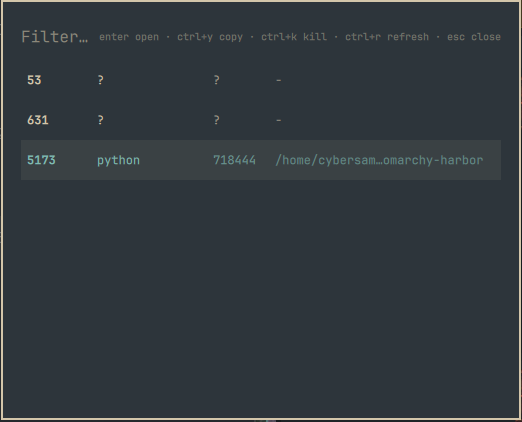

# Harbor

A summonable Omarchy shell overlay showing every listening localhost TCP port, with the owning process, PID, and working directory.
Answers "which dev server is on 5173?" without leaving the keyboard.




## Keys

| Key | Action |
|-----|--------|
| type | Filter the list (e.g. `3000`, `node`, or a directory name) |
| `enter` / click | Open `http://localhost:<port>` in the browser — or copy `localhost:<port>` for known non-HTTP ports (ssh, smtp, dns, rpcbind, cups, mysql, postgres, redis, mongo) |
| `ctrl+y` | Copy `localhost:<port>` to the clipboard |
| `ctrl+k` | Kill the owning process (SIGTERM); press again on a survivor to escalate to SIGKILL |
| `ctrl+r` | Refresh the list |
| arrows / `ctrl+n` / `ctrl+p` | Move selection |
| `esc` | Clear the filter, then close |

## Install

```bash
omarchy plugin add https://github.com/ki11e6/omarchy-harbor --enable
```

Then bind a key in `~/.config/hypr/bindings.lua`:

```lua
o.bind("SUPER + ALT + P", "Harbor", "omarchy-shell shell toggle io.github.ki11e6.harbor")
```

### Bar widget (optional)

Harbor also ships a stateless bar button (no polling, no idle cost) that toggles
the same overlay:

```bash
omarchy plugin enable io.github.ki11e6.harbor --section right
```

Note: for a plugin with both kinds, the bar entry doubles as the enable flag —
if you had already enabled Harbor keyboard-only, run
`omarchy plugin disable io.github.ki11e6.harbor` first so the enable entry can
move onto the bar.

## How it works

The overlay runs `list-ports.sh` (a small `ss -tlnp` wrapper) each time it opens or refreshes, and renders the result with the active Omarchy theme.
Only sockets bound to loopback or wildcard addresses are shown; IPv4/IPv6 duplicates are collapsed to one row per port, preferring the row whose owner is known.

Ports owned by other users (for example root services like CUPS) show `?` for process and PID, since `ss` can't read their process info without root.
`ctrl+k` does nothing for those.

## Dependencies

Everything ships with a stock Omarchy install:

- `jq` — JSON assembly in `list-ports.sh`
- `wl-clipboard` — the copy actions (`wl-copy`)
- `xdg-open` — opening ports in the browser

## Development

```bash
./dev.sh   # sync into ~/.config/omarchy/plugins/, validate, restart the shell, enable
```

## Uninstall

```bash
omarchy plugin remove io.github.ki11e6.harbor
```

## License

MIT
