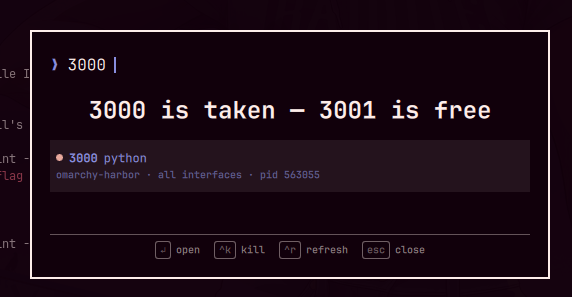

# Harbor 󰀱

**Is this port free?** Harbor is a summonable Omarchy overlay that answers the
`EADDRINUSE` moment: press a key, type a port number, and it says
**"3000 is free"** — or **"3000 is taken — 3001 is free"**, with the holder
named by project checkout rather than thread name and a verified kill one
keystroke away.

See [docs/VISION.md](docs/VISION.md) for what Harbor is for and what it
deliberately does not do.




## The problem it solves

```
Error: listen EADDRINUSE: address already in use :::3000
```

The error names a port, not a process. `lsof -i :3000` needs flags recalled
mid-frustration and answers `node` — which is every JavaScript project on the
machine. You have two ways out: **free the port**, or **move your service to
another one**. Harbor makes both a single keystroke.

## Features

- **Affirmative answers** — type `8080` and get **"8080 is free"**, never an
  ambiguous empty list. Below the privileged-port floor the answer carries a
  "needs root" caveat.
- **Next free port** — when 3000 is taken, Harbor says **"3000 is taken — 3001
  is free"** so you can move instead of fight. Suggestions stay where the
  answer will still hold: never below the privileged floor, never inside the
  kernel's outbound source-port range.
- **Occupied is not just "listening"** — a process that pinned a port for an
  outbound connection holds it as firmly as any server while appearing in no
  listener table, and `SO_REUSEADDR` will not save you. Harbor counts those,
  so "free" means bindable rather than merely un-listened-to.
- **Named by project** — a row reads `3000  node` with `my-app · localhost ·
  pid 1234` beneath it, the project resolved by walking from the server's
  working directory to the nearest `.git`/`package.json`. Four `node`
  processes become four project names. No framework guessing.
- **Verified kills** — `ctrl+k` sends SIGTERM, says **"3000 terminating…"**
  while it re-checks the socket, then reports **"3000 is now free"** or
  **"3000 still listening — ctrl+k again to force"**. The outcome rests on a
  fresh port-scoped `ss` check, never on the signal having been sent. The
  signal itself is identity-checked (pid + uid + start time) against live
  `/proc` immediately before it goes out, narrowing to microseconds the window
  in which a recycled PID could catch a kill meant for its predecessor.
- **Refusals explained** — a port held by another user's process says *needs
  sudo*; a `docker-proxy` port says *docker stop frees this* and a
  socket-activated one says *systemctl stop the .socket unit*, instead of
  offering a kill that would be undone. No silent no-ops.
- **Exposure at a glance** — an urgent dot marks listeners reachable beyond
  localhost; something bound to `192.168.1.5:3000` still blocks your bind, so
  Harbor shows it.
- **Honest failure** — a failed or hung probe says so. Harbor never renders a
  broken probe as "everything is free".
- **Zero idle cost** — nothing polls; the probe runs when you summon it.

## Install

```bash
omarchy plugin add https://github.com/ki11e6/omarchy-harbor --enable
```

## Set the keybinding

Harbor is meant to be summoned from the keyboard. Add to
`~/.config/hypr/bindings.lua`:

```lua
o.bind("SUPER + ALT + P", "Harbor", "omarchy-shell shell toggle io.github.ki11e6.harbor")
```

Keep `"Harbor"` in the description — the bar icon's hover tooltip looks the
binding up by that name and shows it on a second line (`Harbor — is this port
free?` above `SUPER+ALT+P`).
Until a binding exists, the tooltip reminds you to set one. The lookup runs
once at bar load, so after adding or changing the binding, run
`omarchy restart shell` for the tooltip to catch up.

## Keys

| Key | Action |
|-----|--------|
| type | Filter the list — or ask: a filter that is exactly a port number gets the free/taken answer |
| `enter` / click | Open the port in the browser — `localhost` for a wildcard bind, otherwise the address the listener actually holds |
| `ctrl+k` | Kill the owner (SIGTERM) and verify; press again on a survivor to escalate to SIGKILL |
| `ctrl+y` | Copy `<host>:<port>` to the clipboard, using the same host as `enter` |
| `ctrl+r` | Refresh the list |
| arrows / `ctrl+n` / `ctrl+p` | Move selection |
| `esc` | Clear the filter, then close |

## Bar widget

Enabling Harbor also places a stateless 󰀱 anchor on the bar (no polling, no
idle cost) that toggles the same overlay; hovering it shows the plugin name
and your keybinding. `omarchy plugin add --enable` asks which section,
defaulting to `right`. Move it later with:

```bash
omarchy bar move io.github.ki11e6.harbor --section <left|center|right>
```

The bar entry doubles as the plugin's enable flag, so there is no
keyboard-only install: removing the button from the bar
(`omarchy plugin disable`) disables the overlay too.

## Instant open/close (recommended)

Omarchy exempts its own overlays from layer animations, but that rule is
namespace-anchored and can't cover third-party plugins. Add one line to your
`~/.config/hypr/looknfeel.lua` so Harbor pops instantly instead of fading:

```lua
hl.layer_rule({ match = { namespace = "harbor" }, no_anim = true, animation = "none" })
```

## How it works

The overlay runs `list-ports.sh` (a small `ss -tanp` wrapper) each time it opens or refreshes, and renders the result with the active Omarchy theme. One dump answers two different questions: the rows show listeners, because only a listener has a holder worth naming, while the free/taken answer counts every port the machine holds in a bind-refusing state — a socket pinned to a port by an outbound connection refuses your bind just as firmly and appears in no listener table. Only listeners pay for the per-row `/proc` walk.
Every listener is shown whatever address it holds — something on `192.168.1.5:3000` still blocks a `0.0.0.0:3000` bind — with its bind scope (`localhost`, `all interfaces`, or the literal address). Duplicates across address families collapse to one row per process per port, with the widest bind scope; two processes sharing a port on different addresses stay two rows, and a kill that stops one while the other still holds the port says so (`3000 still taken`) rather than claiming it free. A socket shared by a prefork master and its workers is attributed to the master, so `ctrl+k` stops the tree instead of a worker the master would respawn. `enter` and `ctrl+y` target the address the listener actually holds; only a wildcard bind (or `127.0.0.1` itself) is reachable as `localhost`, so a server on `127.0.0.53` or `192.168.1.5` gets its literal address.

Rows are named by the project checkout the server was started from (the nearest ancestor of its working directory carrying `.git`, `package.json`, and similar markers), so four `node` processes read as four project names. No framework guessing: an honest `node` beats a wrong `Next.js`.

A probe that fails or times out says so — Harbor never renders a failed probe as "everything is free". The same rule holds for the bar tooltip: it nudges you to set a keybinding only when the lookup ran and found none, never when it merely failed.

Free claims carry a caveat where "free" is not a promise: below the kernel's unprivileged-port floor ("needs root"), and inside `net.ipv4.ip_local_port_range`, where the kernel draws outbound source ports and a free port can be claimed a moment later. Both ranges are read from the kernel, not hardcoded. Suggestions are held to a stricter bar than reports and never land in either — a recommendation that needs a caveat is not a recommendation.

Ports owned by other users (for example root services like CUPS) show `?` for the process and omit the PID from the context line, since `ss` can't read their process info without root.
`ctrl+k` on those says `owned by another user — needs sudo`; on a `docker-proxy` row it says `container port — docker stop frees this` instead of sending a kill dockerd would undo, and on a `systemd` (socket-activated) row it says `socket-activated — systemctl stop the .socket unit`.

Everything runs unprivileged as your user. `ctrl+k` re-checks the target's identity (pid, uid, start time) against live `/proc` before signaling, narrowing to microseconds the window in which a recycled PID could catch a signal meant for its predecessor — closing it entirely would need `pidfd_send_signal`, which is unreachable from shell. There is no confirmation step — the first press sends SIGTERM (polite), and only a deliberate second press on a survivor sends SIGKILL.

## Configuration

None. Harbor has no options; the filter, keys, and theming (inherited from the active Omarchy theme) are the whole interface.

## Dependencies

Everything ships with a stock Omarchy install:

- `iproute2` — `ss` reads the socket table in `list-ports.sh`, and re-checks the
  single port after a kill
- `jq` — JSON assembly in `list-ports.sh`
- `wl-clipboard` — the copy actions (`wl-copy`)
- `xdg-open` — opening ports in the browser
- `hyprctl` — the bar tooltip's one-shot keybinding lookup

## Development

```bash
./dev.sh              # sync into ~/.config/omarchy/plugins/, validate, restart the shell, enable
bash test/fixtures.sh # regression fixtures: probe, dedup, kill helper, answer logic
```

Beyond the runtime dependencies, `dev.sh` needs `rsync`, and the fixtures need
`node` and `python3` — they start throwaway servers to exercise the project-name
walk against real `/proc` entries.

## Uninstall

```bash
omarchy plugin remove io.github.ki11e6.harbor
```

## Credits

Harbor began as a ground-up rewrite inspired by
[SVIGHNESH/omarchy-portboard](https://github.com/SVIGHNESH/omarchy-portboard) —
the first Omarchy plugin to put listening ports in a summonable overlay. The
architecture (a QML overlay over a small `ss` wrapper script) follows its lead;
the code was rewritten from scratch. Thank you!

## License

MIT
